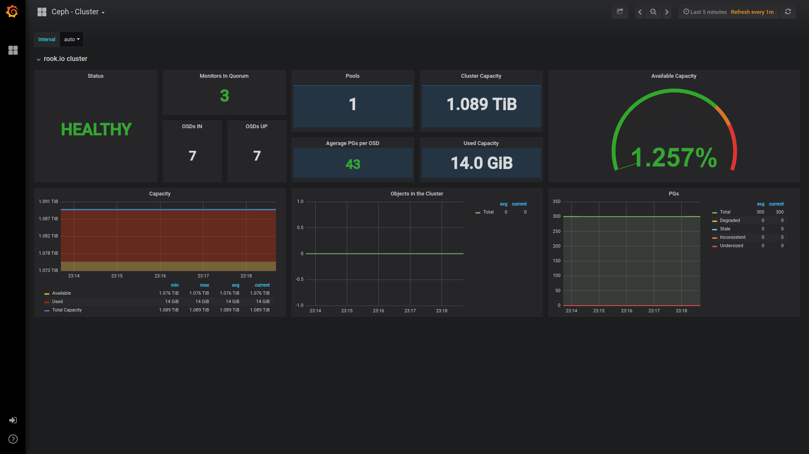

# Simple Grafana Dashboard for Rook



This repository ships a grafana instance with a predefined dashboard with basic stats about the health of your rook cluster.

# Requirements

* a kubernetes cluster with the latest version of the [rook operator](https://rook.io).
* a deployed [prometheus operator](https://github.com/coreos/prometheus-operator)

# Setup

First, if not already done earlier, deploy the rook specific prometheus instance by

```
# kubectl apply -f https://raw.githubusercontent.com/rook/rook/master/cluster/examples/kubernetes/monitoring/prometheus.yaml
# kubectl apply -f https://github.com/rook/rook/raw/master/cluster/examples/kubernetes/monitoring/service-monitor.yaml
# kubectl apply -f https://github.com/rook/rook/raw/master/cluster/examples/kubernetes/monitoring/prometheus-service.yaml
```

(alternatively you can use this repositories distribution of prometheus setup which is not up-to-date with rooks repo but proofed working)

```
# kubectl apply -f monitoring/
```

To install grafana with rook dashboard:

```
# kubectl apply -f grafana/
```


# Access UI

Prometheus UI is on node port 30900 (30910 if deployed from this repo)
Grafanas node port is 30912
